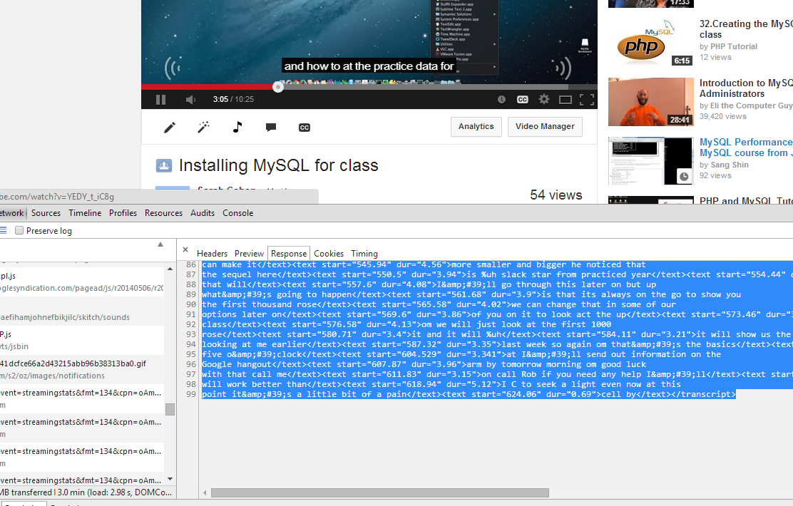

# Where to go from here #

## GIS and mapping ##

With mapping, you can:

* Aggregate accidents, crimes, complaints or any other points into Zip codes, census tracts or other areas based on their location.
* Find hot spots based on density.
* Find the right places for your reporting 

The hardest part of mapping is finding the proper geographical files you need to match against your data. There are all kinds of help files out there, but try to get the original geographic data from your sources before you try them. 

### Tools ###

* Fusion Tables from Google for simple mapping and geocoding, to see how points gather around areas. Great for finding a good place to report or to easily publish simple interactive maps. Here is an [IRE handout](http://www.ire.org/resource-center/tipsheets/4081/download/?fileid=4056) from Tim Henderson on getting started

*  ArcView / ArcMap / ArcGIS is the industrial strength geographical information system that is used by most local governments, environmental researchers, traffic analysts and others who need to both create maps from scratch and analyze distances, directions and shapes. If you get a chance, you can sign up for an IRE workshop on using the software and get a free copy (worth about $2,000). Your next newsroom might already have it. You can also sign up for a [limited free online account](http://www.esri.com/software/arcgis/arcgisonline/features/free-personal-account). (Windows and Unix only)

* Leaflet with Mapbox.js, a free alternative. [Another handout from IRE](http://www.ire.org/resource-center/tipsheets/4088/download/?fileid=4054), this one from Becca Aaronson. She is using QGIS for geographical operations, a free alternative to ArcView. 

* R and MySQL have GIS capabilities for programmers.

## Network analysis ##

Networks analysis is useful any time you want to find things related to one another. Don't just think of this as social networks -- it's a way to find clusters and connections as well. 

For example, The Washington Post once got a database of student visas, which showed the administrators in charge of visas for each school. It turned out there was a network of language schools in California that accounted for 2 percent of all visas in the U.S. Others have used network analysis to identify polarization in Congress, powerful people in local government and interlocking boards of directors.

### Tools ###
* NodeXL, for Windows. The simplest way to work with small networks, but only available on that platform.
* Gephi, an experimental system that was demo'd in class. It's not that stable, but is quite useful.
* networkx, a library for Python. This was what we used to identify gun sellers.
*  [R](http://sna.stanford.edu/rlabs.php)'s igraph and other libraries. 

## Unstructured data analysis ##
Unstructured data refers to information that comes to you without columns and rows. Examples include emails, regulatory documents, a source's hard drive, photo collections, Tweets, and videos of city council meetings. 

There are three technologies that journalists are particularly interested in:
 
* Entity (or information) extraction: The process of identifying names, places, dates and other structured bits of information using grammar and other natural language processing techniques.
 
* Classification: Identifying an interesting set of documents from a sample of a larger collection, and training the computer to recognize others.
* Clustering: Letting various algorithms decide which items are more similar to one another than to others in the collection. 

## Tools for investigative data and document analysis ## 

### Text analysis ###

<a href="documentcloud.org">DocumentCloud</a>, good for tagging and searching unsearchable documents. If you have one long document, will provide basic entity extraction using 

<a href="overview.org">Overview</a>, which you all know about. Automatic clustering of documents based on common words.

<a href="voyant-tools.org">Voyant Tools</a>, a quick way to see the structure of a document or document collection, with in-context searching and maps of where tools fall in the collection. 

<a href="http://www.cc.gatech.edu/gvu/ii/jigsaw/">Jigsaw</a>, an analytic platform for text analysis, including topic modeling and entity extraction. It lets you identify certain roles for people, so that you can, for example, define prosecutors vs. defendants. Good for modest collections of short documents.

<a href="http://nlp.stanford.edu/downloads/">Stanford NLP projects</a>, containing software for various linguistic techniques including named entity recognition and part-of-speech parsers.

<a href="https://gate.ac.uk/">GATE, a "general architecture for text engineering</a>. Among its offerings is ANNIE, which is another named entity extractor. This probably comes in the most languages, and has been around for at least 20 years. 

<a href="http://wordseer.berkeley.edu/wordseer-3-0/">Word Seer</a>, a project from the National Endowment for the Humanities and researchers at Berkeley.

<a href="http://gking.harvard.edu/readme">ReadMe</a>, an R-based platform for conducting supervised machine learning on a set of documents.

### Speech and video recognition ###

<a href="http://cmusphinx.sourceforge.net/">CMU Sphinx Project</a>, with open source software for automatic transcription.

YouTube's automatic captioning of uploaded videos. To get the text of what it has found, open an "Inspect Element" tab in Chrome, switch to the Network tab and start the video. Look for "CC" symbol on the lower right corner of the video, then press it and choose On. Look through your Network tab to find the 2nd of two "timedtext" elements, and then switch from Header to Response on the right hand tab. You can copy the timed text to your clipboard.

There are a lot of other speech recognition apps on the market, but most rely on excellent recording conditions of a single person. They are generally for dictation from a single person.

  
  